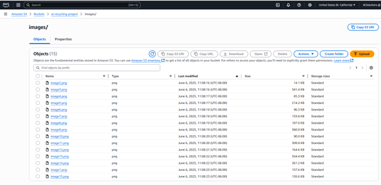
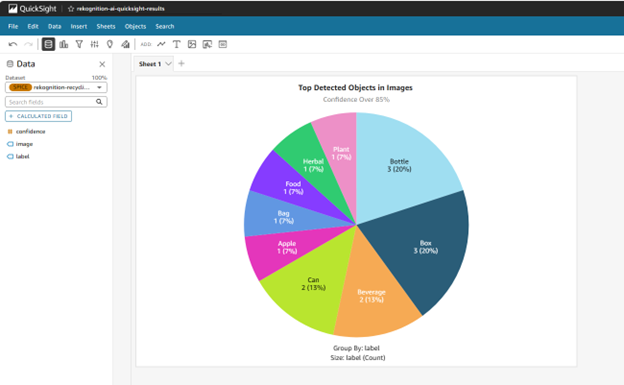
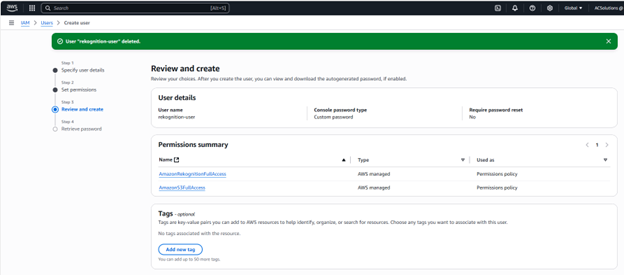

# ♻️ AWS AI Recycling Detection Project

## 🌍 Real-World Context
In real-world scenarios, municipalities, recycling facilities, and smart waste management systems can benefit from automating the identification of recyclable materials. For example:
Smart trash bins could use cameras and AI models like this to sort recyclables automatically.
Municipal services could analyze footage from street cameras or collection points to improve recycling efficiency.
Environmental researchers could use image data to study waste disposal patterns.

This project provides a lightweight prototype to simulate such applications using AWS Free Tier services.

---

## 🚀 Tech Stack

- **Python 3.10**
- **Amazon Rekognition (AI Label Detection)**
- **Amazon S3 (Storage)**
- **AWS QuickSight (Data Visualization)**
- **VS Code + Git + GitHub**

---

## 🔧 How It Works

1. **Upload Images**  
   Upload images of various materials (e.g., bottles, paper, cans) to an Amazon S3 bucket.

   


2. **Run Rekognition Script**  
   A Python script calls the Rekognition API to detect labels in each image with at least **85% confidence**, then saves the results to a CSV file.

   ```Python 
   def analyze_image_bytes(bucket, key):
    obj = s3.get_object(Bucket=bucket, Key=key)
    img_bytes = obj['Body'].read()
    result = rekognition.detect_labels(
        Image={'Bytes': img_bytes},
        MaxLabels=10,
        MinConfidence=85
    )
    ...
    ```

3. **Visualize Data in QuickSight**  
   The CSV file is uploaded to S3 and used to create a dashboard in QuickSight to analyze label frequency and confidence levels.

    

---

## 📁 Folder Structure

```
aws-reciclagem-projeto/
├── images/                  # Images stored in S3 bucket
├── results/                 # Output CSV and manifest.json for QuickSight
├── rekognition_processa.py  # Main script for label detection
├── manifest.json            # QuickSight import descriptor
└── README.md                # This documentation
```

---

## 🔐 AWS Permissions Used

This project uses an IAM user with the following policies:

- `AmazonRekognitionFullAccess`
- `AmazonS3FullAccess`

   

---

## 📌 Limitations

- Limited to images under 5MB due to Rekognition API constraints.
- Not a production system — designed for educational and demo purposes under the AWS Free Tier.

---

## ✨ Future Improvements

- Filter detected labels by category (e.g., show only recyclable items).
- Automatically classify images as "recyclable" or "non-recyclable" using custom logic or a trained ML model.
- Automate the process for production use by integrating AWS Lambda or Amazon SageMaker to run the Python script, and AWS Athena to feed a dynamic QuickSight dashboard.

---

## 🙋‍♀️ Contact

Amanda Arenales  
email: [amandaarenales@gmail.com](mailto:amandaarenales@gmail.com)  
Calgary, AB, Canada  
